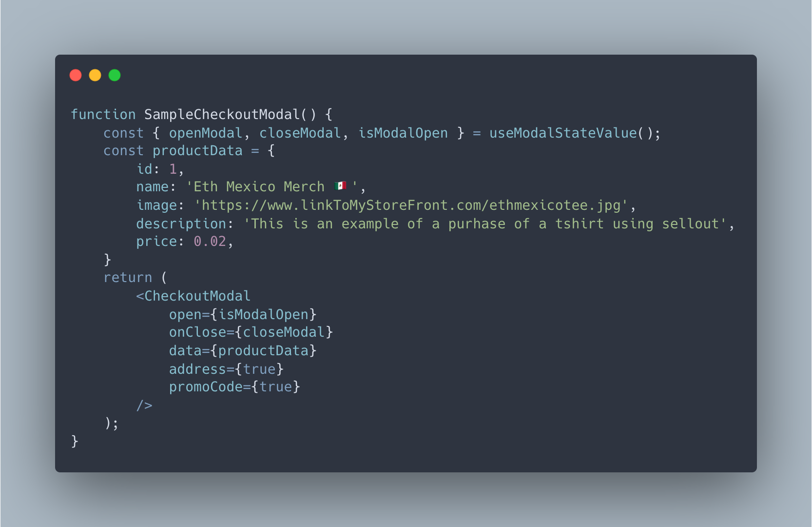
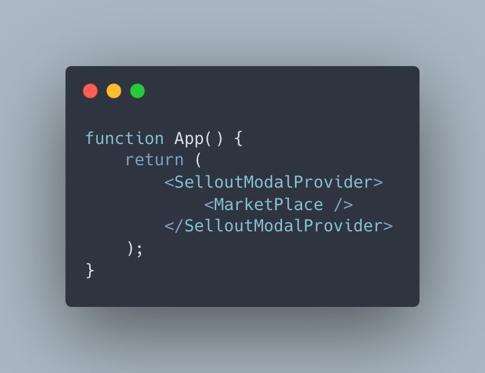

    

# Sell Out

The best way to checkout in a dApp.

## Repo and Demo Site
🕺 Demo Site: https://sellout-ten.vercel.app/  
🐙 Github: https://github.com/jackburrus/sellout

# 🧐 Project philosophy

Sell Out aims to be a delightful checkout experience for developers to easily integrate into their dApps. Inspired by RainbowKit, Sell Out uses a single React component to handle the entire checkout lifecycle. Don't ever stress about complex modals and checkout flows. Let Sell Out handle it so you can focus on, selling out.

# ⚛ Components

#### Import the `<CheckoutModal />` to add a fully typed checkout component to your app.

    

 

#### Wrap your app in the `<SellOutProvider />` to get access to a bunch of handy hooks!

    

# 👨‍💻 Tech stack

Here's a brief high-level overview of the tech stack Sell Out uses:

- [NFT Storage](https://nft.storage/docs/)
- [Polygon](https://wiki.polygon.technology/)
- [React](https://reactjs.org/)
- [TypeScript](https://www.typescriptlang.org/)
- [WAGMI](https://wagmi.sh/)
- [Tailwind CSS](https://tailwindcss.com/)
